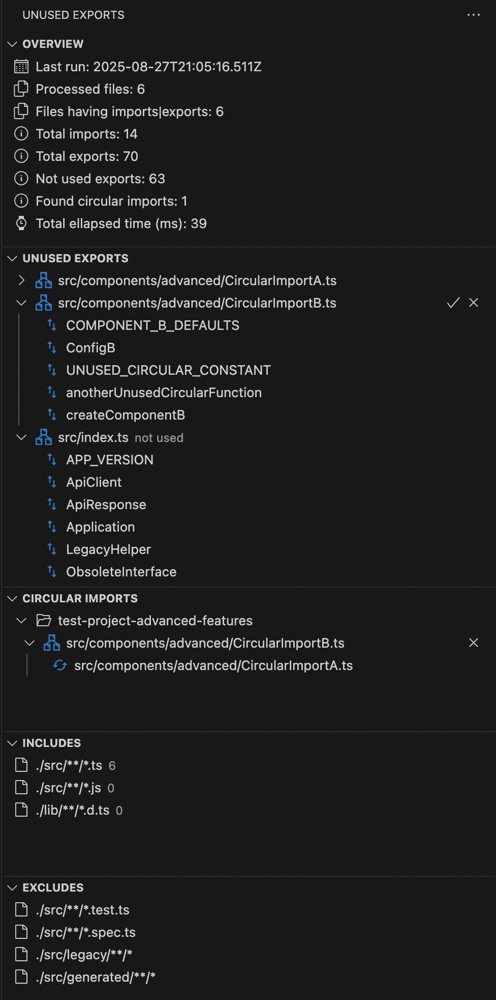

# Find Unused Exports

Automatically find all exports in typescript and javascript files which are not imported in other files.

## Features

- Automatically find all exports and imports in .ts and .tsx files
- Automatically find all exports and imports in .js and .jsx files, if tsconfig.json allows for .js files in project
- All imports from node modules are ignored
- The test files are ignored, hence the exports used only by unit tests will be displayed as not used
- If tsconfig.json defines baseUrl, it will resolve all imports using paths relative to baseUrl
- A file having all exports not used will be marked as "not used" and a delete button will be available
- If there are no unused exports, then the panel will display an entry saying this
- Can detect circular imports, which produce undefined variables by import

## Usage

This extension has its own panel. The symbol of this panel is a ban sign with two arrows (see bellow).

Open the panel and the extension will start the scan of the project. If you made changes to the files, the extension will not detect these to avoid unnecessary scans. You can force a rescan using the reload button found at top right of the panel.

If there are no unused exports, the panel will display a single entry saying this.

### Screenshot

Bellow you can see the list of unused exports found in the currently opened project as are they displayed by this extension:

## Requirements

There are no special requirements.

## Extension Settings

- findUnusedExports.debug:

  - Find unused exports: log all actions in an output window
  - default false

- findUnusedExports.showIgnoredExports

  - Find unused exports: show all unused exports, even if they are marked as ignored
  - default false

- findUnusedExports.detectCircularImports

  - Find unused exports: detect circular imports
  - default true

## Known Issues

For the moment there are no known issues.

Note: If the main/entry file has exports then this extension marks it as "not used" and allows you to remove it. Hence, please check before deleting any file if it is the main/entry file.

## Change Log

See Change Log [here](CHANGELOG.md)

## Issues

Submit an [issue](https://github.com/iulian-radu-at/find-unused-exports/issues) if you find any bug or have any request.

## Contribution

Fork the [repo](https://github.com/iulian-radu-at/find-unused-exports) and submit pull requests.
